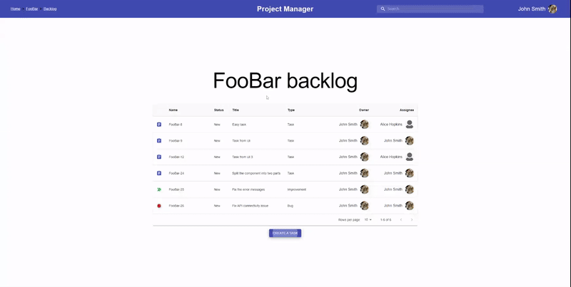
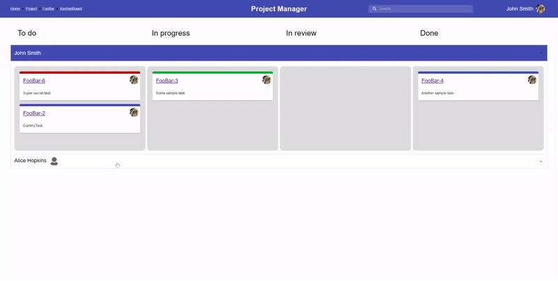
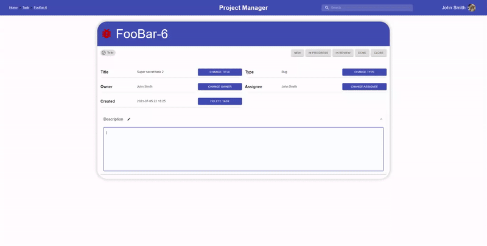
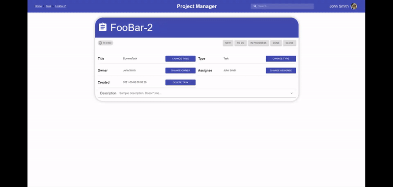
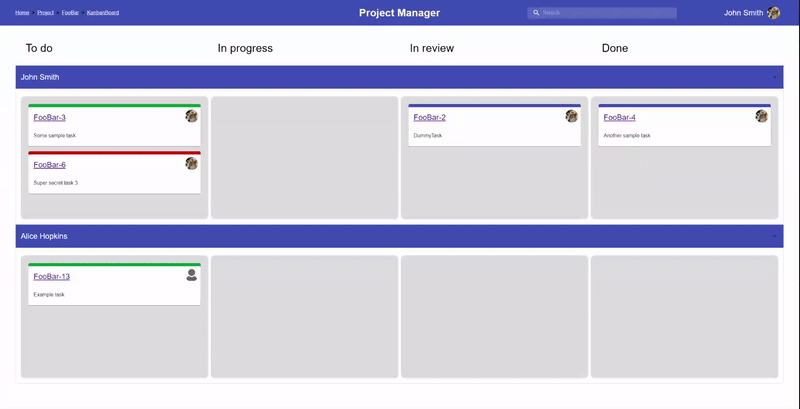

# ProjectManager

A full-stack application for project management.

## Tech stack

* Frontend - React + TypeScript
* Backend - Django + Django Rest Framework
* DB - Postgresql

## Features

* user registration
* Projects
* Backlog

  

* Kanban board

  

* Issues

  

* Breadcrumbs
  * for easier navigation

## Responsiveness

All the pages are responsive for easier reading on smaller/split screens.

## TODO

* switch to using JWT via `httpOnly` cookies or Django's sessions
* update from MUI v4 to MUI v5
* add subtasks
* possibly rewrite the backend to FastAPI
* deploy the application on a Kubernetes cluster
