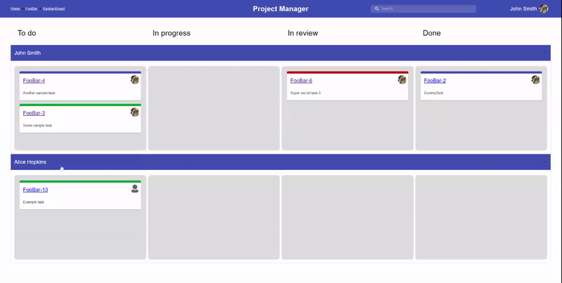

# ProjectManager

A full-stack application for project management.

## Tech stack

* Frontend - React + TypeScript
* Backend - Python + Django + Django Rest Framework
* DB - Postgresql

## Features

* User registration
* Profile editing
<!-- # TODO: add a GIF -->
* Projects
* Issues

  

* Backlog

  

* Kanban board

  

* Breadcrumbs - for easier site navigation

  

## Responsiveness

## TODO

* switch to using JWT via `httpOnly` cookies or better yet - Django's sessions
* update from MUI v4 to MUI v5
* possibly rewrite the backend to FastAPI
* deploy the application on a Kubernetes cluster
* `useSWR` everything!
